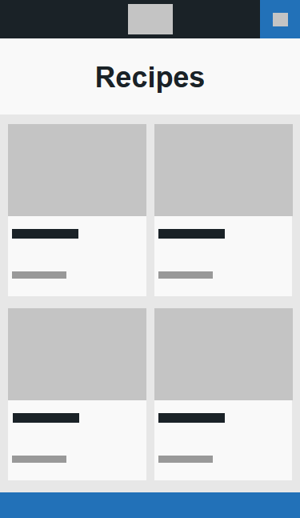
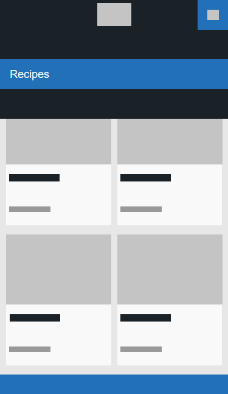
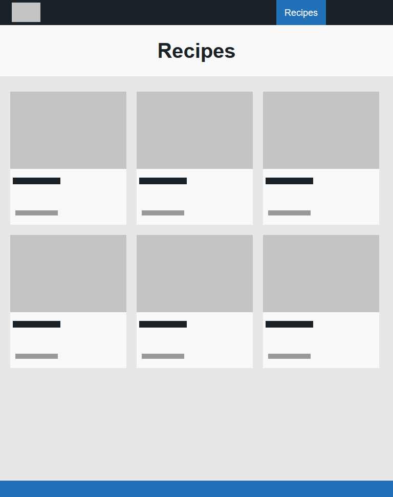
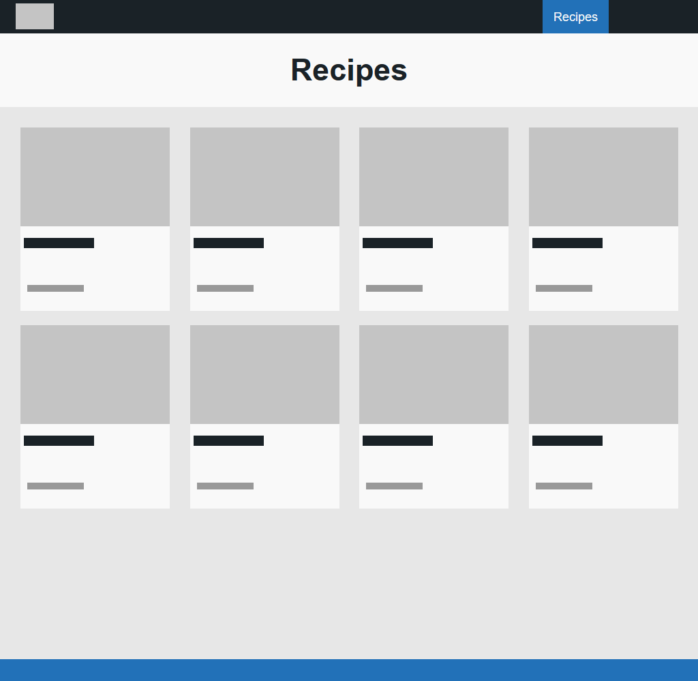
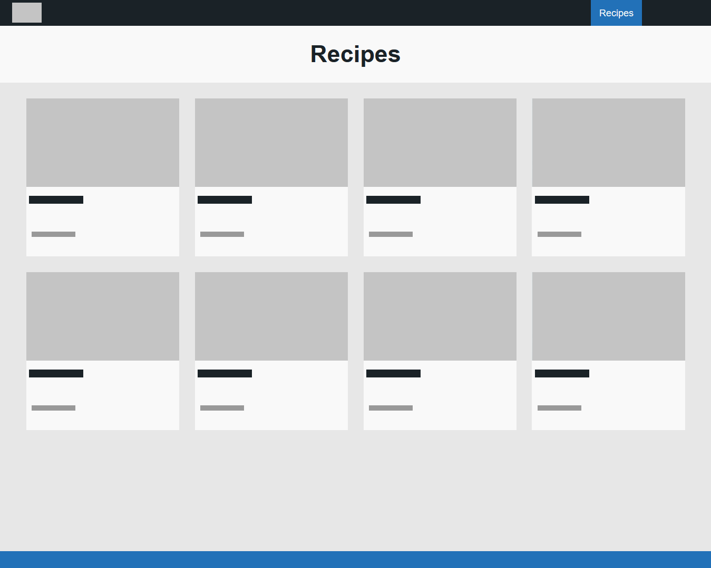
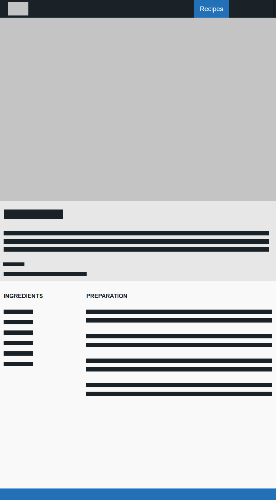
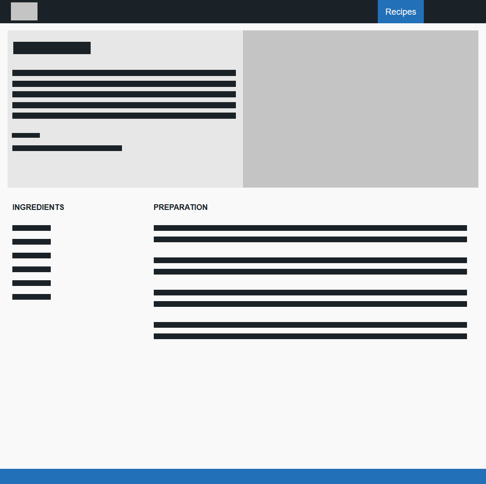
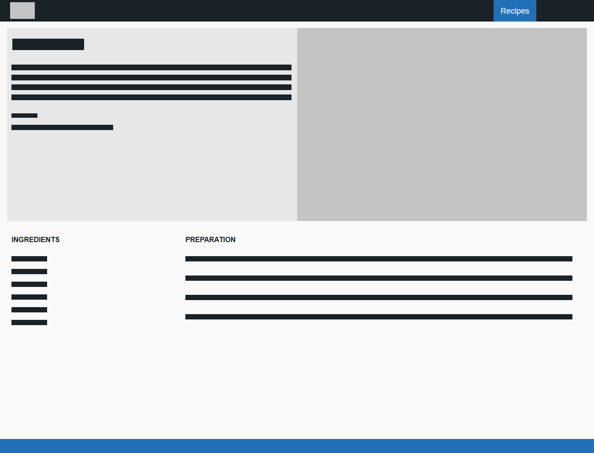

# Recipes Website

Github Repository: [https://github.com/DiogoRHJMatos/CDA404](https://github.com/DiogoRHJMatos/CDA404)

## Contents

1. Background
2. Wire Frames
3. Colour Choices
4. Accessibility
5. GDPR
6. Distance Selling
7. Evaluation

## 1. Background

This assessment aimed to create a responsive website and attempt to solve a problem, in this case, the problem is that I always wanted to easily share with my family, friends and the entire web my recipes but never really had the motivation to do it until now. The website was created using HTML, CSS, Javascript and with some icons of the fontawesome library.

## 2. Wire Frames

The website began in paper creating some low-fidelity sketches of the main recipe page and the individual recipes page, and later on, passed to the computer for the medium and high-fidelity. This project was developed mobile-first, using different overviews to achieve the desired result in landscaped mobiles, tablets, desktops and larger desktops.

Main Recipe Page:

Individual Recipes Page:

## 3. Colour Choices

The colour choice was based on the ones used for the Digital Creative (DES400) unit first assessment, Branding Exercise. The objective was to create a logo to brand ourselves, and since I already had a logo I used it and implemented the whole palette around it. The theme aimed for was to make a modern and minimalistic looking website, making it more aesthetically pleasing to interact and navigate.

Colour Palette:

## 4. Accessibility

It was essential to make sure that the website is easily accessible to everyone, including people with disabilities. To guarantee a good user experience, the W3C accessibility standards were implemented using the 'alt=""' tag in every image, providing alternative text and allowing screen readers to describe clearly the image.

## 5. GDPR

The General Data Protection Regulations (GDPR) wasn't used on this project although it is extremely important and mandatory, because it was the first time to get in contact with such thing, it was overwhelming to understand everything, therefore, it wasn't implemented.

## 6. Distance Selling

If services or goods are being sold, it is mandatory to provide certain information according to the online and distance selling act, since this website is for personal use and no services or goods are being sold, measures weren't taken.

## 7. Evaluation

Overall, I believe the website was well developed and the minimalistic design aimed for was well achieved. The website was constantly tested for the different overviews using the Responsive Design Mode tool available in every browser, making changes to the code always following and trying to match the sketches to achieve the desired result. It was in this part where more problems appeared and where more thought was put in since the dimensions differ so much from each other, it was necessary to create the best solution possible to resolve the issue on every overview.

Although the initial idea was different, making a website of my experiences, places travelled, interesting things in different countries, places to try food and recipes, only the latter was presented because of the lack of time and opportunity that the COVID-19 pandemic created. Some parts of the original idea are still present in the code because it is still planned to implement in the future and create the first imagined website.

To conclude, this assessment was helpful to remind and teach me new things on how to create a simple website, implementing the self-knowledge from past experiences, as well as the learning outcomes of the Web Technologies unit.
